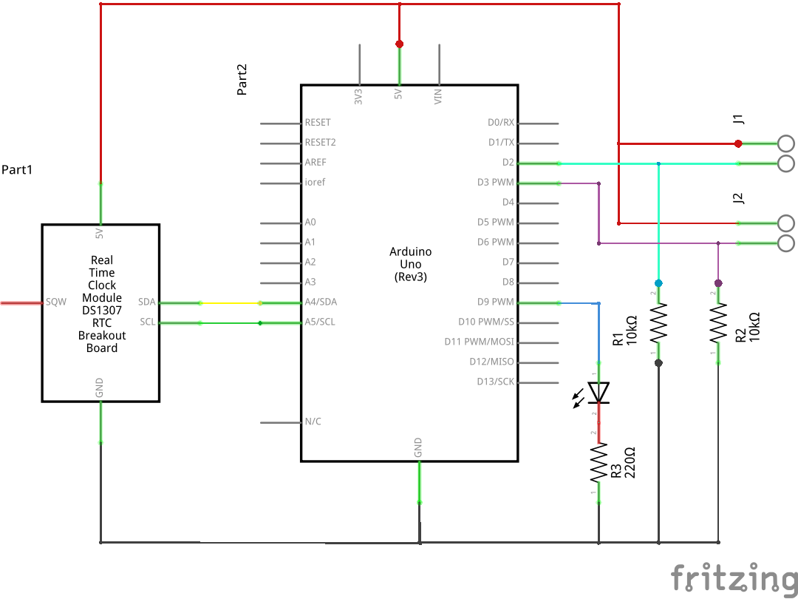

# FunTechHouse_ElectricityMeter

Electricity meter, read the pulses and post the results.
This project uses a Arduino with a Ethernet shield,
and sends its results using MQTT to a Mosquitto server.

Fore more info:
* http://fun-tech.se/FunTechHouse/ElectricityMeter/

## Hardware

First prototype:

